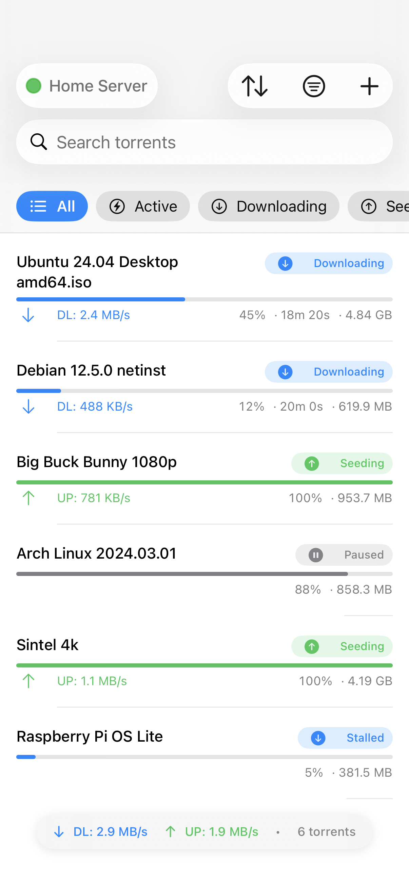
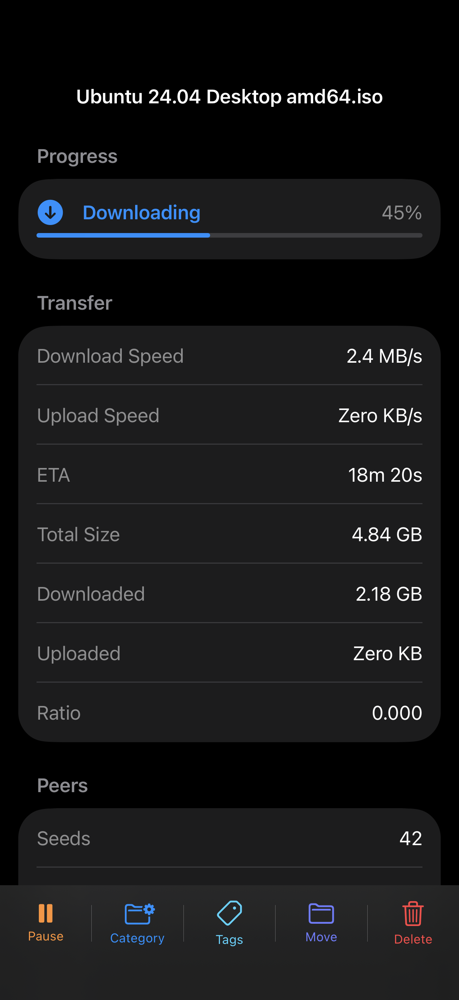
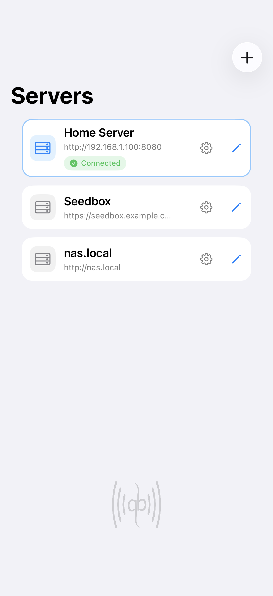
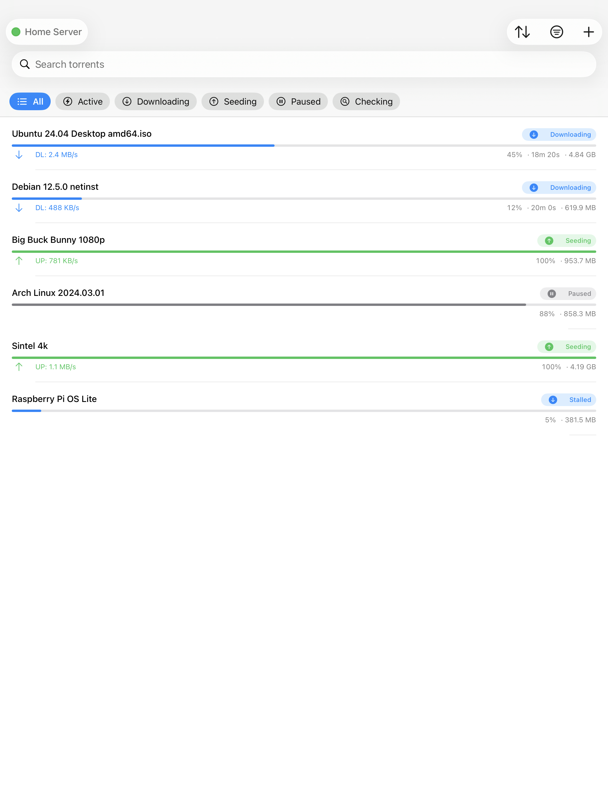

<p align="center">
  
</p>

<h1 align="center">Simple qBittorrent Remote</h1>

<p align="center">
  Your qBittorrent server, at your fingertips.<br>
  A native, open-source SwiftUI app for iPhone and iPad.
</p>

<p align="center">
  <a href="https://apps.apple.com/app/id6760194789">
    
  </a>
</p>

<p align="center">
  <a href="#screenshots">Screenshots</a> ·
  <a href="#features">Features</a> ·
  <a href="#build-from-source">Build from source</a> ·
  <a href="SUPPORT.md">Support</a> ·
  <a href="CONTRIBUTING.md">Contribute</a>
</p>

Manage downloads, add torrents, and switch between servers without opening the Web UI.
Your files stay on your computer or NAS. The app controls a qBittorrent server that you own and does not download torrent data to your iPhone or iPad.

## Screenshots

<p align="center">
  
  &nbsp;
  
  &nbsp;
  
</p>

<p align="center">Track downloads · Inspect torrent details · Switch servers</p>

<details>
  <summary>See the iPad layout</summary>
  <p align="center">
    
  </p>
</details>

Screenshots show demo data from the repository's visual tests. The App Store version can differ from the current source.

## Features

- Connect to multiple qBittorrent servers.
- Add magnet links, torrent URLs, and `.torrent` files.
- Pause, resume, delete, move, categorize, and tag torrents.
- Search, filter, and sort the torrent list.
- View transfer rates, progress, tracker details, and peer counts.
- Change selected qBittorrent server preferences.
- Store passwords and session cookies in the iOS Keychain.
- Use demo mode without a qBittorrent server.

## Get started

1. [Download the app from the App Store](https://apps.apple.com/app/id6760194789) on an iPhone or iPad with iOS or iPadOS 26.1 or later.
2. Enable the Web UI on your qBittorrent server.
3. Add your server address and credentials in the app, then tap Save.

Test Connection checks the values before you save. To explore the app without a server, enable demo mode in Settings.

## Build from source

You need macOS with Xcode 26 or later. The app target has no third-party runtime dependencies.
The snapshot-test target uses `swift-snapshot-testing`.

```sh
git clone https://github.com/ryancummings/qBRemote.git
cd qBRemote
open qbremote.xcodeproj
```

Select the `qbremote` scheme and an iOS simulator. Then run the app.

If you run the app on a physical device, select your development team in Xcode. Use a unique bundle identifier if your Apple account does not own `com.OneRadStudio.qbremote`.

## Security notes

The app stores each server password and session cookie in the iOS Keychain. It does not store these values in SwiftData or UserDefaults.

Plain HTTP is available because many qBittorrent servers run on a private network. HTTP does not protect credentials or traffic from other devices on that network. Use HTTPS or a trusted private network.

Support for an untrusted TLS certificate is disabled by default. You must enable it for each server profile.

Read [SECURITY.md](SECURITY.md) before you report a security problem.

## Architecture

The app uses SwiftUI, SwiftData, Observation, `URLSession`, and Swift concurrency. Network workflows use typed server sessions:

```text
View
  -> @Observable view model
    -> QBServerSession.run(QBOperation)
      -> production API service -> URLSession or test transport
      -> demo adapter
```

A server session represents access to one saved profile. It owns cookie restoration, shared login attempts, one authentication retry, and connection status. `TorrentListViewModel` owns refresh orchestration, polling, and torrent actions. External additions can target another profile without changing the active server.

`ServerProfile` stores non-secret configuration. `ServerProfileDraft` owns editing, unsaved connection tests, explicit saves, and credential rollback when persistence fails. `KeychainService` stores secrets by profile UUID.

`TorrentBrowsing` derives results and available filter options from the latest torrents. Server switches preserve search and sorting but clear category, tag, location, and tracker selections. Polling retains selections that disappear from the available options. Browsing choices stay in memory only.

Read the [domain glossary](CONTEXT.md), [typed-session decision](docs/adr/0001-use-typed-operations-for-server-sessions.md), and [implementation rules](AGENTS.md) before changing these boundaries.

## Tests

Install Fastlane and `xcbeautify` if you want to use the command-line lanes:

```sh
brew install fastlane xcbeautify
fastlane test
```

You can also run the `qbremote` test action in Xcode.

Visual snapshot tests use reference images from the iOS 26.5 simulator runtime. The command creates its named iPhone and iPad simulators when needed:

```sh
fastlane snapshot_tests
```

The required simulator names and image comparison rules are in [AGENTS.md](AGENTS.md).

## Contributing

Read [CONTRIBUTING.md](CONTRIBUTING.md) before you open a pull request. Use GitHub Issues for confirmed bugs and focused feature requests.

## License

Copyright 2026 Ryan Cummings.

This project is available under the [MIT License](LICENSE).

This project is independent. It is not affiliated with or endorsed by the qBittorrent project.
